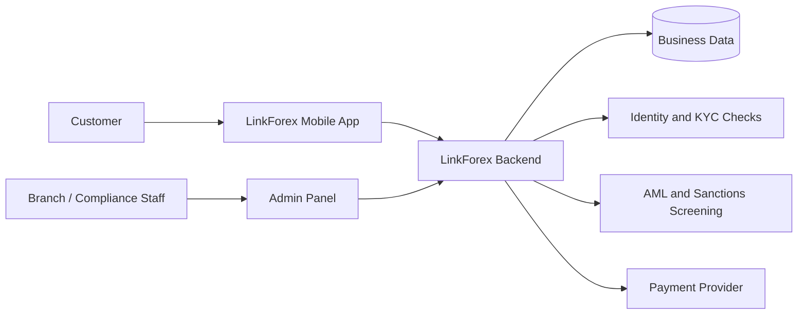
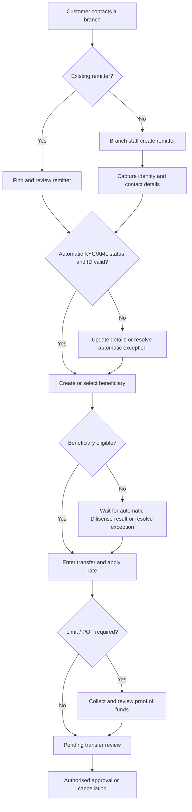
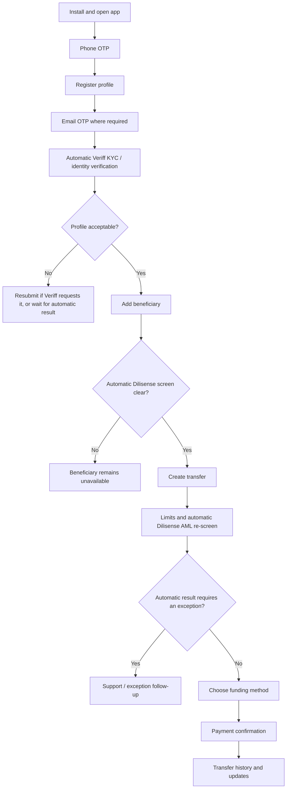
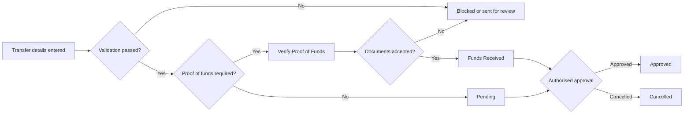

# LinkForex System Guide

## What LinkForex Includes

LinkForex has three connected systems. Together they allow the business to register customers, complete compliance checks, create and manage remittances, and keep staff control of operations.

| System | Who uses it | Why it exists |
| --- | --- | --- |
| Admin Panel | Branch staff, compliance staff, managers and system administrators | Runs the day-to-day business: customers, beneficiaries, transfers, rates, compliance, reports, staff users and app controls. |
| Backend System | Used in the background by the Admin Panel and Mobile App | Stores all business data, applies security rules, checks limits, creates reports, and connects external services. Staff do not normally use this directly. |
| LinkForex Mobile App | Customers sending money | Lets customers register, verify their phone/email/identity, add beneficiaries, submit transfers, upload proof of funds and contact support. |

## Main People in the System

| Person | Meaning | What they can do |
| --- | --- | --- |
| System Administrator | Full-access internal user | Manages staff, roles, branches, reference data, settings and all operational records. |
| Branch Staff | Staff assigned to one branch | Works with customers and transfers for their branch, depending on permissions. |
| Compliance Staff | Compliance exception and operations reviewer | Monitors automatic Veriff and Dilisense outcomes, and investigates only flagged, failed, resubmission or other exception cases, plus proof-of-funds cases. |
| Remitter | The person sending money | Registers through the mobile app or is created by staff. |
| Beneficiary / Receiver | The person receiving money | Is saved under a remitter and must be suitable for use before a transfer can be made. |

## How the Three Systems Work Together

The backend is the central record. A customer cannot bypass rules by changing something in the mobile app or browser. The backend checks the user's role, their branch, record status, limits and compliance requirements before accepting an action.

## Business Data and Why It Is Kept

| Data area | Main information held | Why it is needed |
| --- | --- | --- |
| Staff users | Name, email, role, branch, active status | Controls who can use the Admin Panel and what they can access. |
| Roles and permissions | Menu/page access and allowed actions | Ensures staff only see and perform work assigned to their job. |
| User logs | Sign-in, sign-off, duration, IP/country and reason | Provides an audit trail for staff access and security events. |
| Branches | Branch name, code, address and transaction identity | Separates operations by branch and identifies where records belong. |
| Remitters | Customer contact, address, identity, KYC and AML information | Identifies the sender and proves they are eligible to send money. |
| Beneficiaries | Receiver name, relationship, country, bank/payment details and screening result | Identifies who receives the money and supports compliance checks. |
| Transfers | Sender, receiver, amount, currencies, rate, purpose, status and documents | Creates the complete remittance transaction record. |
| Rates | Branch cash rates, digital rates and customer-specific rates | Calculates the exchange rate shown to staff and customers. |
| Reference data | Countries, banks, relationships, purposes and occupations | Makes forms consistent and prevents free-text data errors. |
| Compliance reports | KYC decisions, AML/sanctions results, PDF reports and proof-of-funds documents | Supports regulatory checks, investigation and audit requirements. |
| Support tickets | Customer questions and staff replies | Gives customers a tracked route to request help. |
| Mobile content | App settings, onboarding images, campaigns and notifications | Lets the business manage the app experience without a new mobile build. |

## Admin Panel Sidebar Guide

The sidebar is permission-based. A staff member only sees the sections their role allows. Even if somebody manually types a page address, the system checks their permission again and denies access if they are not allowed.

### Dashboard

| Menu | What it shows | Why staff use it |
| --- | --- | --- |
| Dashboard | Business totals, recent activity, transfer/customer trends and branch information | Gives management and staff a quick view of current operations. |

### Operations

| Menu | What it is for | Important information on the screen |
| --- | --- | --- |
| New Transfer | Creates a transfer entered by staff | Select remitter and beneficiary, amount, currencies, exchange rate, purpose, branch and payment details. The system checks KYC, limits, branch access and available configuration before saving. |
| Transfers | Finds and manages all staff-created transfers | Transfer reference, sender, beneficiary, branch, amount, rate, status, dates and actions such as approve, cancel, export or review proof of funds. |
| Remitters | Manages senders/customers | Customer name, mobile, email, branch, identity details, KYC status, AML status, documents and history. |
| Receivers | Manages beneficiaries/receivers | Receiver name, linked remitter, country, bank/payment details, relationship, status and AML/compliance reports. |
| Branch Access Flags | Controls cross-branch customer access | Requesting branch, owner branch, remitter, request date and approval status. The owning branch must approve before another branch can work with that remitter. |
| Support | Handles customer requests from the Mobile App | Ticket number, customer, subject, status, unread messages, request type and conversation history. |
| Branch Rates | Manages rates available at each branch | Branch, currency pair, cash rate, digital rate, effective status and last update. |

#### Transfer status meaning

| Status | Meaning | Normal next action |
| --- | --- | --- |
| Pending | Transfer was created and is waiting for review/processing | Check details and approve if permitted. |
| Verify Proof of Funds | Amount/risk rules require proof of funds | Customer/staff supplies documents; compliance reviews them. |
| Funds Received | Required funding/documents are accepted | Continue with the applicable approval/processing process. |
| Approved | Transfer has been approved | Treat as a completed approval decision; it should not be cancelled through the normal flow. |
| Cancelled | Transfer was cancelled | Review the audit record if needed. |

### Master Data

These menus hold reusable business values. Changing them affects forms and operational rules across the system.

| Menu | What it is for | Key fields and why they matter |
| --- | --- | --- |
| Branches | Creates and maintains company branches | Branch name, branch code, transaction prefix, contact/location and active status. Branch codes identify ownership and support branch security. |
| Transaction Settings | Defines transaction limits and rules | Channel, currency, period and limit amount. Used to stop or route transfers that exceed configured limits. |
| API Tokens | Controls external-service usage settings | Provider/service, usage controls and status. Used internally to monitor allowed service use. |
| Dilisense Sources | Maintains sources used by AML screening | Source name, source type, enabled state and fuzzy-match settings. This helps keep screening results consistent. |

### Reports

| Menu | What it is for | What staff can review |
| --- | --- | --- |
| Reports | Operational management reporting | Transfer, customer and business trend summaries. Individual compliance PDFs are opened from the related remitter, receiver or mobile profile. |

### Mobile Controls

These menus manage what customers see and what staff must review in the Mobile App.

| Menu | What it is for | Key fields and actions |
| --- | --- | --- |
| Overview | Mobile operations summary | Shows mobile activity and wallet-transfer operational items. |
| Mobile Profiles | Manages customers registered in the Mobile App | Customer identity, verification state, app status, KYC status, device/mobile details and activity. |
| App Flow Settings | Controls customer-app behaviour | Enables/disables app access, security steps, identity flow, support, wallet and compliance-related options. |
| Customer Digital Rates | Sets general rates shown in the app | Currency pair, customer digital rate, active status and effective timing. |
| User Rates | Sets a special rate for one customer | Customer, currency pair, special rate, active status and validity. |
| Profile Review Queue | Monitoring and exception area for mobile verification | Customer, automatic Veriff decision, ID/face evidence and report. Normal KYC approval/decline is applied automatically; staff use this area only when a provider result needs follow-up. |
| Campaigns | Sends customer communications | Campaign name, message, target group, delivery status and send history. |
| Onboarding & Carousel | Controls app images and promotional content | Title, image, position/order, target/action, start/end date and enabled state. |

### Application Basic Data

| Menu | What it is for | Key fields and why they matter |
| --- | --- | --- |
| Countries | Maintains supported and restricted countries | Country name/code, risk level, blacklist status, payout availability and allowed currencies. These values control transfer and beneficiary options. |
| Banks | Maintains bank options | Bank name/code, country and active/role flags. Used in beneficiary payment forms. |
| Relationships | Maintains sender-to-beneficiary relationships | Relationship name and active status. Used to explain why a remitter is sending to a beneficiary. |
| Purposes | Maintains transfer purpose options | Purpose name and active status. Used for transfer compliance information. |
| Occupations | Maintains occupation options | Occupation name and active status. Used in customer profile information. |

### System Users

| Menu | What it is for | Key fields and actions |
| --- | --- | --- |
| Role | Defines staff job roles | Role name, description and active status. A role is assigned to staff users. |
| Role Permissions | Defines exactly what each role can do | Role, system section and allowed actions such as view, create, edit, delete, approve, export or run screening. |
| Users | Creates and manages staff accounts | Name, email, role, branch, active status and account controls. Staff should only be given the minimum access required. |
| User Logs | Reviews staff session activity | Session number, user, active/closed status, sign-in, sign-off, duration, country, IP and sign-off note. |

#### User Logs column meaning

| Column | Meaning |
| --- | --- |
| Session | Unique record for one login session. |
| User | Staff account that signed in. |
| Status | `Active` means the session is currently valid; `Closed` means it ended. |
| Sign In | Time the session began. |
| Sign Off | Time the session ended. |
| Duration | How long the session remained open. |
| Country | Country detected from the user's network address. |
| IP | The public network address used for the session. IPv4 or IPv6 is valid; mobile networks may change it between sessions. |
| Sign-off Note | Why the session ended, for example user signed out, tab closed, session superseded by a new login, or unauthorized access attempt. |

### Configuration

| Menu | What it is for |
| --- | --- |
| Configuration | Holds general non-secret operational settings. Passwords and provider secrets are intentionally not shown in the Admin Panel. |

## Branch Journey

1. A staff user belongs to a branch.
2. That user normally sees and works with customers and transfers belonging to that branch.
3. If a remitter belongs to another branch, the staff member requests access through **Branch Access Flags**.
4. The branch that owns the remitter approves or rejects the request.
5. Only after approval can the requesting branch use that remitter for its work.
6. Administrators can work across branches according to their full-access role.

This protects branch ownership and prevents a staff member from using records outside their authorised area.

## Staff Transfer Journey

1. Staff find or create the remitter.
2. Staff find or create the beneficiary.
3. The system checks that the beneficiary is suitable for use, the remitter's documents are valid, the country/currency is allowed and the branch has access to the remitter.
4. Staff enter the transfer amount, currency, rate and purpose.
5. The system checks transaction limits and compliance requirements.
6. If proof of funds is required, the transfer waits for documents and review.
7. An authorised person approves the transfer when all conditions are satisfied.
8. The system keeps an audit history of approvals, cancellations and important changes.

## End-to-End Branch Customer and Transfer Journey

This is the full journey when a customer walks into, calls, or is handled by a branch team rather than creating their own transfer in the Mobile App.

### Step 1: Identify the customer at the branch

| Staff action | What staff check | Why it matters |
| --- | --- | --- |
| Search before creating a person | Name, mobile number, email, identity number and existing records | Prevents duplicate remitters and allows staff to see past activity. |
| Confirm branch ownership | The remitter's branch and whether staff have cross-branch approval | Protects branch-owned records and prevents staff using another branch's customers without permission. |
| Confirm account status | Active/inactive status, KYC state, ID document dates and existing compliance holds | An inactive, unverified or restricted remitter must not proceed as though fully cleared. |
| Review existing beneficiary list | Receiver names, payment information and compliance status | Avoids creating a duplicate beneficiary and helps select an already eligible recipient. |

### Step 2: Create or update the remitter

The remitter is the sender. The branch should create one remitter record per real person, then keep it current rather than creating a new record for every transfer.

| Information collected | Why it is collected | How it is used |
| --- | --- | --- |
| Full legal name | Identifies the sender | Appears on customer, compliance and transfer records. |
| Date of birth | Helps identify the person and support screening | Used for profile/compliance matching where required. |
| Mobile number | Customer contact and mobile account identity | Used for communication and Mobile App verification. |
| Email address | Customer contact and email verification | Used for OTPs, notices and account recovery where enabled. |
| Residential address/country | Customer profile and risk context | Supports customer records and country-related controls. |
| Occupation | Customer profile/compliance context | Uses the controlled Occupations list. |
| Identity document type/number | Proves identity | Supports KYC and expiry validation. |
| Identity issue/expiry dates | Confirms document is current | Expired identity can block further processing. |
| Branch | Establishes record ownership | Determines which staff can normally work with the customer. |
| Supporting documents | Keeps evidence where required | Available only to authorised staff for review. |

#### Remitter decisions

| If the system finds... | Staff should do... | Result |
| --- | --- | --- |
| An existing matching remitter | Open and verify the existing record | Reuse the same customer record. |
| Outdated contact/address/identity data | Update it with the correct evidence | Customer record stays current. |
| Expired identity document | Obtain updated identity data and follow required review process | Transfer remains restricted until resolved. |
| Incomplete, declined, resubmission or exception KYC/AML state | Wait for the automatic provider result or resolve the exception | Do not treat the remitter as cleared. |
| A different owning branch | Request Branch Access Flags approval | Work can continue only after appropriate approval. |

### Step 3: Create or select the beneficiary

The beneficiary is a separate record because one customer can send to many people, and each receiver may have a different country, bank account and compliance result.

| Beneficiary information | Why it is collected |
| --- | --- |
| Full recipient name | Identifies the person receiving funds. |
| Relationship to remitter | Explains the sender/receiver connection for transfer and compliance records. |
| Country | Determines whether the payout destination is supported or restricted. |
| Contact/address information | Supports recipient identification where required. |
| Bank name, account/IBAN and branch details | Directs the payout to the correct destination. |
| Receiver identity information | Supports verification/screening where required. |
| Screening status and report | Shows the automatic Dilisense result and whether the beneficiary is eligible, pending, flagged or has a provider exception. |

#### Beneficiary decisions

| Beneficiary state | Can staff start a transfer? | What happens next |
| --- | --- | --- |
| Active and cleared | Yes | Use the beneficiary for the transfer. |
| New/pending screen | Not until the automatic screen is complete | Wait for the Dilisense result. |
| Flagged/provider exception | No | Staff investigate the report or technical exception. |
| Inactive | No | Update/reactivate only through authorised process. |
| Country/bank not supported | No | Choose a valid destination or update approved reference data if business policy allows. |

### Step 4: Enter the transfer

| Transfer field | What it means | Why it matters |
| --- | --- | --- |
| Transfer reference | Unique transfer number | Used to find, report and audit the transaction. |
| Remitter | Person sending the funds | Must be active, permitted and suitable for the transfer. |
| Beneficiary | Person receiving the funds | Must be eligible for use. |
| Branch | Branch handling the transaction | Controls ownership and operational visibility. |
| Sending amount | Amount the customer pays/sends | Used for funding, limits and calculation. |
| Sending currency | Currency supplied by the customer | Determines eligible rate/payment configuration. |
| Payout currency | Currency received by beneficiary | Must be enabled for the destination. |
| Exchange rate | Rate applied to the transaction | Used to calculate payout and must come from an active permitted rate. |
| Payout amount | Amount beneficiary receives | Calculated from amount/rate, subject to applicable fees/rules. |
| Transfer purpose | Reason for payment | Required compliance/business information. |
| Payment/funding method | How the transfer is funded | Determines the subsequent payment/evidence workflow. |
| Status | Current stage in transfer lifecycle | Tells staff what can happen next. |

### Step 5: Review limits, documents and approval

| Trigger | System action | Staff/customer action |
| --- | --- | --- |
| All validation passes and no additional evidence is needed | Transfer enters normal pending workflow | Authorised staff review and approve/cancel. |
| Amount exceeds configured limit | Transfer requires proof of funds | Collect appropriate documents and review them. |
| Customer-specific limit is exceeded | Transfer is held for a limit decision | Review whether a permitted override/request is needed. |
| Automatic Veriff/Dilisense result is pending, flagged, unavailable or rejected | Transfer cannot continue normally | Wait for the automatic result or investigate only the exception; do not override a normal provider decision. |
| Valid proof of funds accepted | Transfer moves forward | Continue operational approval workflow. |
| Transfer is approved | Approval is recorded with user/time | Process as approved; standard cancellation is no longer available. |

## End-to-End Mobile Customer and Transfer Journey

This is the full journey for a customer using the Mobile App without branch staff creating the initial record.

### Mobile account creation in detail

| Customer step | What the app/system does | Customer outcome |
| --- | --- | --- |
| Opens app | Loads current business settings and confirms app access is enabled | Customer can proceed only if the app/account flow is available. |
| Enters mobile number | Sends a phone OTP through the configured phone-verification service | Customer receives a code to prove control of the phone. |
| Confirms phone OTP | Marks the phone number as verified | Registration can continue. |
| Enters profile information | Saves required personal/contact information | Creates the customer profile in the central business record. |
| Confirms email OTP | Marks email as verified | Confirms the customer controls the entered email address. |
| Creates/signs in to account | Checks account status and security requirements | Customer reaches the appropriate next screen, or is asked to resolve a security requirement. |
| Uses a new device | May be asked to complete configured device/mobile verification | Protects the account from unauthorised device access. |

### Mobile KYC in detail

| Customer step | System behaviour | Result |
| --- | --- | --- |
| Opens identity verification | Checks whether identity verification is required/enabled | Customer is guided to the identity process. |
| Supplies required personal/identity information | Creates the Veriff verification request | Automatic identity evaluation can begin. |
| Completes liveness/document process | Veriff evaluates the evidence and returns its result | An approved, declined, resubmission or pending state is recorded automatically. |
| Decision is approved | Profile becomes eligible for the permitted transfer journey | Customer can continue, subject to beneficiary/limit/AML rules. |
| Decision is resubmission | Customer is asked to submit again | Customer remains restricted until a successful outcome. |
| Decision is pending/not started | No final clearance exists yet | Customer must wait or complete missing verification steps. |
| A result is declined, resubmission, pending or technically failed | The record is visible in the Profile Review Queue with its evidence | Staff follow up only on the exception; they do not manually approve a normal Veriff result. |

### Mobile beneficiary journey in detail

| Customer step | System behaviour | Result |
| --- | --- | --- |
| Opens beneficiaries | Shows beneficiaries linked to the signed-in customer | Customer can choose existing eligible beneficiaries or add one. |
| Adds receiver/payout details | Checks mandatory fields and supported country/bank information | Beneficiary is saved under the customer. |
| Screening begins | Dilisense automatically runs beneficiary AML/sanctions screening | Status and report are stored against the beneficiary. |
| Clear/approved result | Beneficiary becomes eligible for the next transfer step | Customer can select them for a transfer. |
| Pending/flag/provider-error result | Beneficiary remains unavailable | Customer is prevented from using them until the automatic result is clear or an exception is resolved. |

### Mobile transfer journey in detail

| Customer step | System behaviour | Result |
| --- | --- | --- |
| Selects beneficiary | Confirms beneficiary is active and eligible | Invalid/in-review beneficiaries cannot be selected. |
| Enters sending amount and payout details | Finds the active applicable customer rate | App shows calculated transfer information. |
| Selects purpose | Stores required transfer reason | Helps meet business/compliance record requirements. |
| Submits transfer request | Checks profile/KYC, beneficiary, currencies, rates, rolling limits and AML conditions | Transfer either proceeds or is sent to the correct review path. |
| AML result is flagged/pending or a limit exception exists | Creates/uses the appropriate support or operational follow-up process | Customer sees that the transfer cannot proceed normally yet. |
| Selects card funding | Opens approved hosted payment process | Payment success must be confirmed by the central system. |
| Selects wallet funding | Shows configured wallet instructions and captures reference/proof as required | Operations can review funding information. |
| Proof of funds is requested | Customer uploads documents | Transfer waits for authorised review. |
| Transfer is accepted/processed | Status is shown in transfer history | Customer can follow progress and open available details. |

### What the customer sees in Mobile App sections

| App area | Customer purpose | What the system controls |
| --- | --- | --- |
| Home | Quick account/transfer overview | Available actions, digital rates, campaigns and account restrictions. |
| Beneficiaries | Add/manage recipients | Whether a beneficiary is eligible for transfer use. |
| Transfer | Create a new transfer | Profile, KYC, AML, limits, currencies, rates and funding validation. |
| History | View previous transfer activity | Transaction status and available details/documents. |
| Profile | Manage personal information and verification | Account, password/device security and KYC-related restrictions. |
| Support | Ask the business for help | Ticket creation, replies, statuses and unread notifications. |

## Form and List Column Reference

This section explains the main information staff see across normal operational lists. Exact columns may vary by user role, filters and screen size, but the business meaning remains the same.

### Remitter list and profile fields

| Field/column | Meaning | Why it is important |
| --- | --- | --- |
| Remitter ID/reference | Internal customer identifier | Lets staff find the correct record and supports auditing. |
| Name | Customer's legal name | Primary customer identification. |
| Mobile/email | Customer contact details | Used for communications and verification. |
| Branch | Owning branch | Controls standard staff visibility and responsibility. |
| Status | Active/inactive/suspended state | Determines whether customer can use services. |
| KYC status | Identity verification result/stage | Determines whether protected activity may proceed. |
| AML/compliance status | Screening/review state | Shows whether further compliance action is required. |
| ID expiry | Identity document expiry date | Protects against using expired identity evidence. |
| Created/updated details | Record history fields | Supports accountability and audit. |

### Beneficiary list and profile fields

| Field/column | Meaning | Why it is important |
| --- | --- | --- |
| Beneficiary ID/reference | Internal receiver identifier | Finds the correct recipient record. |
| Beneficiary name | Receiver legal name | Must match payment/compliance information. |
| Linked remitter | Customer who owns this beneficiary relationship | Establishes who is allowed to use the recipient. |
| Relationship | Sender's relationship to recipient | Important transfer/compliance context. |
| Country | Payout destination | Determines available payout and risk rules. |
| Bank/payment data | Recipient payment destination | Required for correct payout processing. |
| Screening status | Clear, pending, review or inactive status | Determines whether the beneficiary can be selected. |
| Report/history | Related compliance evidence | Supports authorised investigation/review. |

### Transfer list fields

| Field/column | Meaning | Why it is important |
| --- | --- | --- |
| Transfer reference | Unique transaction identifier | Main reference for customers, staff and reports. |
| Date/time | When transfer was created/updated | Supports processing order and investigation. |
| Remitter | Sender | Shows who requested/sent the money. |
| Beneficiary | Receiver | Shows where the funds are directed. |
| Branch | Responsible branch | Supports operational ownership. |
| Send amount/currency | Amount paid by customer | Funding and calculation basis. |
| Payout amount/currency | Amount received by beneficiary | Payout result. |
| Rate | Applied exchange rate | Explains currency calculation. |
| Purpose | Reason for sending | Required business/compliance context. |
| Status | Current workflow stage | Tells staff whether to approve, review documents, cancel or wait. |
| Created by/updated by | Staff/account that made the change | Audit accountability. |

### Support ticket fields

| Field/column | Meaning | Why it is important |
| --- | --- | --- |
| Ticket number | Unique support reference | Allows customer/staff to follow the same case. |
| Customer | Person who raised the ticket | Establishes ownership and context. |
| Subject/type | Reason for the request | Helps route the ticket to operations, AML or limit review. |
| Status | Open, in progress, resolved or similar stage | Shows whether action remains required. |
| Last message/unread count | Latest conversation activity | Helps staff respond promptly. |
| Created/updated date | Ticket timeline | Supports service and audit tracking. |

## Customer Mobile App Journey

### 1. Registration and sign-in

1. Customer enters their mobile number.
2. Customer receives and confirms a phone OTP.
3. Customer completes registration details.
4. Customer verifies their email by OTP when required.
5. The app checks whether the account is active and whether any security step is required before allowing access.

### 2. Identity verification

1. Customer completes profile and identity details.
2. Customer completes the required identity/liveness verification.
3. Veriff automatically evaluates the identity/liveness evidence and returns a decision to the system.
4. The system automatically updates the KYC status from the Veriff response/webhook.
5. The Profile Review Queue keeps the automatic decision, report and identity images visible for audit and exceptions only.
6. Until an approved automatic result is received, restricted actions such as sending money remain blocked.

### 3. Adding a beneficiary

1. Customer enters the receiver's personal and bank/payment information.
2. The system stores the beneficiary under that customer.
3. Dilisense automatically screens the beneficiary against configured AML/sanctions sources and creates a report record.
4. If the automatic result is pending, flagged or unavailable, the customer cannot use the beneficiary until it is clear or the exception is resolved.

### 4. Sending money

1. Customer selects an active beneficiary.
2. Customer enters amount, payout currency and transfer purpose.
3. The app shows the applicable digital rate and transfer result.
4. The system checks limits, profile status and automatically re-screens AML/compliance conditions through Dilisense.
5. If there is an AML hit, pending/error result or limit exception, a support request can be created for operational follow-up.
6. Customer completes the available funding method, such as card or wallet payment.
7. If proof of funds is needed, the customer uploads documents.
8. Customer can track transfer history and open supported transaction details/documents.

### 5. Help and notifications

1. Customer opens Support to create a ticket or reply to an existing conversation.
2. Staff reply from the Admin Panel.
3. The app can show unread ticket updates and receive push notifications where enabled.

## Compliance Journey

| Check | Who it applies to | Purpose | Where it is reviewed |
| --- | --- | --- | --- |
| Veriff identity/KYC | Remitter/customer | Veriff automatically checks identity and liveness, then returns an approved, declined, resubmission or pending decision | System updates the profile automatically; the queue is for audit and exceptions. |
| Dilisense AML/sanctions | Remitter, beneficiary and transfer | Dilisense automatically screens configured names/watchlists, stores the outcome and creates report evidence | Clear results proceed subject to other rules; hits, errors and pending results require exception follow-up. |
| Proof of Funds | Transfer/remitter | Supports review of higher-risk or over-limit transfers | Transfer details and operational approval workflow. |

KYC, beneficiary screening and AML reports are related but separate. A customer completing identity verification does not automatically make every beneficiary approved.

## Security Rules Explained Simply

* Staff access is controlled by roles and permissions.
* Branch staff are limited to their branch unless cross-branch access is approved.
* The system re-checks permission and branch access when data is opened, edited, approved or downloaded.
* Changing a browser address does not give access to another record.
* Invalid or unauthorised access attempts are logged and may close the user's session.
* Session logs record sign-in and sign-off activity for investigation.
* Customer and staff documents are retained as protected business records, including copies of identity media needed for future review.

## Complete Business Logic

This section explains the system decisions in plain language. These rules apply whether an action starts from the Admin Panel or Mobile App.

### Staff login, session and access logic

| Situation | System decision |
| --- | --- |
| A staff user enters valid login details | A new session is created and the login is recorded in User Logs. |
| Staff account is inactive | Login is refused. |
| Staff user's role does not allow a menu/page | The menu is hidden and the page is refused if accessed directly. |
| Staff user tries to open/edit a record outside their branch | The request is refused unless cross-branch access was approved or the user has full access. |
| Staff user signs out | The current session is closed with the note `User signed out`. |
| Browser tab is closed | The system attempts to close the session with the note `Tab closed`. A network/browser interruption may mean this is recorded on the next session check instead. |
| Same account starts a new session | The earlier session can be closed as `Session superseded by new login`, according to the active session policy. |
| Staff user tries an unauthorised page or action | Access is refused, the event is logged, and the session can be closed as an unauthorised access attempt. |
| Session expires or becomes invalid | The user is returned to login and must sign in again. |

### Permission logic

Permissions are assigned to a role, then the role is assigned to staff users. A permission can allow a person to see a section and separately allow them to act in it.

| Permission type | What it allows |
| --- | --- |
| View | Open a list, page or record. |
| Create/Add | Create a new record. |
| Edit | Change an existing record. |
| Delete | Delete an eligible record. |
| Approve | Approve an eligible transfer, document or workflow item. |
| Cancel | Cancel an eligible transfer. |
| Export/Print/PDF | Download or print permitted reports/documents. |
| Screening/Re-screening | Run or repeat a compliance check. |
| Upload Reports | Attach a permitted compliance report/document. |
| Branch Access | Review or approve cross-branch access where assigned. |

Giving someone `View` permission does not automatically give them approval, deletion, PDF, export or screening rights.

### Branch logic

| Situation | System decision |
| --- | --- |
| A record belongs to the staff user's branch | The branch user may work with it if their role permits the action. |
| A record belongs to another branch | The record is not available for normal branch work. |
| Another branch needs to use a remitter | A cross-branch access request is created. |
| Owner branch approves access | The requesting branch can use that remitter within the approved scope. |
| Owner branch rejects access | The requesting branch remains blocked. |
| Administrator/full-access user works with a record | They can work across branches when their role permits it. |

### Remitter logic

| Situation | System decision |
| --- | --- |
| Staff/mobile user creates a remitter | Required identity, contact and profile data are checked before saving. |
| Potential duplicate customer is found | The system warns staff before a conflicting customer record is created. |
| Remitter identity document is expired or close to expiry | Transfer and profile flows can be restricted until updated identity information is supplied/reviewed. |
| Automatic Veriff KYC is incomplete, declined, resubmission or pending | Protected customer actions, including sending money, remain restricted until Veriff returns an approved result. |
| Remitter is inactive/suspended | Login and/or transactions are blocked until an authorised change is made. |
| Remitter data is changed | The change is recorded for audit and remains subject to branch and role controls. |

### Beneficiary logic

| Situation | System decision |
| --- | --- |
| Customer/staff adds a beneficiary | Required recipient, country and payment/bank information is checked and saved under the remitter. |
| Beneficiary is created or amended | Dilisense screening is automatically started and a report record is created. |
| Automatic screen is clear | Beneficiary can be available for transfer use, subject to all other transfer rules. |
| Automatic screen is pending or provider response fails | Beneficiary cannot be used until the result is available. |
| Automatic screen is flagged | The case is held for exception investigation; it must not be treated as an approved recipient. |
| Staff tries to use another branch's beneficiary/remitter relationship | Normal branch access rules still apply. |

### Rate logic

| Situation | System decision |
| --- | --- |
| Staff creates a branch transfer | The system uses the configured eligible branch rate for the chosen currencies and channel. |
| Customer creates a mobile transfer | The system uses the active customer digital rate, unless that customer has an active individual override. |
| A user-specific rate exists | It takes priority for that eligible customer/currency pair. |
| No active applicable rate exists | The transfer cannot continue until a valid rate is configured. |
| Currency/country is disabled, blacklisted or not allowed for payout | The option is not eligible for the transfer. |

### Transfer validation logic

Before a transfer is created, the system checks the following:

| Check | Why it is checked | If it fails |
| --- | --- | --- |
| Staff/customer access | Confirms the actor is allowed to create the transfer | Transfer is refused. |
| Branch ownership/access | Protects branch-owned remitter records | Transfer is refused or cross-branch approval is requested. |
| Remitter status/KYC | Ensures sender is active and has an approved automatic Veriff result | Transfer is held/refused until resolved. |
| Beneficiary status | Ensures receiver has a clear automatic Dilisense result | Transfer is refused until the screening result is clear. |
| Country/currency rules | Prevents unsupported or restricted payout combinations | Transfer is refused. |
| Active rate | Ensures a valid rate is available | Transfer is refused until a rate is configured. |
| Transfer purpose | Ensures compliance information is captured | Required information must be supplied. |
| Transaction limits | Applies business/risk limits by customer, channel, currency and period | Proof of funds or a limit review is required. |
| AML/compliance checks | Automatically re-screens the transfer through Dilisense and prevents risk cases from proceeding | A hit, pending/error result is held and may create a support/operational task. |

### Transfer lifecycle logic

| Lifecycle point | What staff/customer should understand |
| --- | --- |
| Validation blocked | The transfer was not accepted because required information, access, rate, beneficiary, KYC, AML or country/currency rules are not satisfied. |
| Pending | The transfer exists and is waiting for authorised operational review/action. |
| Verify Proof of Funds | The transfer amount or risk rule requires supporting documents before normal processing. |
| Funds Received | Required funding/supporting evidence has been accepted and the transfer is ready for the next permitted operational decision. |
| Approved | An authorised staff member approved the transfer. The normal system flow does not allow it to be cancelled afterwards. |
| Cancelled | Processing has stopped. The history/audit record explains who cancelled it and when. |

### Proof of funds logic

| Situation | System decision |
| --- | --- |
| Transfer is within normal configured limits | Proof of funds is not automatically required. |
| Transfer exceeds applicable limit/risk condition | Transfer moves to proof-of-funds review and supporting documents are required. |
| Customer uploads documents | Documents are attached to the transfer for staff review. |
| Authorised staff accepts documents | The transfer can move forward in its workflow. |
| Documents are missing, unsuitable or rejected | The transfer remains restricted until resolved or cancelled. |

### Mobile registration and OTP logic

| Situation | System decision |
| --- | --- |
| Customer enters a mobile number | The app starts phone OTP verification. |
| OTP is entered correctly | The phone number is confirmed and registration can continue. |
| OTP fails, expires or is not delivered | The customer must retry after the provider/app allows another attempt. |
| Customer enters an email | The app can send an email OTP to confirm ownership. |
| Email OTP is confirmed | Email is marked verified. |
| New/unrecognised device requires verification | The customer is asked to complete the configured mobile/device verification before continuing. |
| Account is inactive, suspended or requires password change | The customer is blocked or routed to the required recovery/change process. |

### KYC logic

| Situation | System decision |
| --- | --- |
| Customer starts identity verification | An identity/liveness session is created. |
| Customer completes the identity process | Veriff automatically evaluates the identity/liveness evidence and returns a decision or resubmission request. |
| Verification is approved | The system automatically marks the customer eligible for permitted next steps, subject to other checks. |
| Verification is declined | The system automatically keeps the customer restricted; staff only follow up if there is an exception. |
| Verification requests resubmission | Customer must submit acceptable identity information again. |
| Decision is still pending/not started | It is not a pass. Restricted features remain blocked until the process is complete. |
| Identity media is received | It is retained with the automatic decision for authorised audit, exception follow-up and future evidence. |

### AML and sanctions logic

| Situation | System decision |
| --- | --- |
| A remitter or beneficiary is created/changed | The system automatically sends the required person information to Dilisense. |
| A mobile transfer is submitted | The system automatically re-screens AML server-side through Dilisense so the mobile app cannot bypass the check. |
| No match / clear result | The result is stored automatically and the record can proceed only if all other required checks are clear. |
| Possible hit/match | The automatic result holds the record for exception investigation. A possible hit is not automatically an approval or rejection. |
| Service response is unavailable or still pending | The record remains pending and must not be treated as cleared. |
| A Dilisense report is generated | The report is automatically stored as compliance evidence and can be opened by authorised staff. |

### Payment and funding logic

| Situation | System decision |
| --- | --- |
| Customer selects card funding | The app opens the configured hosted payment flow. |
| Payment provider reports successful payment | The backend validates the result before treating the payment as successful. |
| Customer is redirected back without a confirmed provider result | Redirect alone does not prove payment; the backend confirmation is required. |
| Customer selects wallet funding | The app displays the configured wallet instructions and collects payment/reference details. |
| Funding proof/reference needs review | The transfer waits for the permitted operational decision. |

### Support and notification logic

| Situation | System decision |
| --- | --- |
| Customer creates a support request | A ticket is created and appears in the Admin Panel support area. |
| Customer needs AML or limit review | The system can create/route a support request for operations. |
| Staff replies | The response is stored in the ticket conversation and can be shown to the customer. |
| There are unread updates | The app can display an unread count and send a push notification when enabled. |
| Ticket is resolved | Staff update its status so operational queues remain accurate. |

### Audit and document logic

| Situation | System decision |
| --- | --- |
| Important record is created, edited, approved or cancelled | The system stores an audit trail of the action and acting staff user. |
| Staff downloads an AML/compliance report | The action requires the appropriate report/PDF permission. |
| A document belongs to a remitter, beneficiary or transfer | It is only available to authorised users within their allowed branch/scope. |
| A record is removed | Only an eligible record and authorised role may delete it; linked/operational records can prevent deletion. |
| A historical transfer/report exists | It remains part of the business/audit record even if later configuration values change. |

## Daily Operating Checklist

1. Monitor automatic Veriff and Dilisense exceptions, resubmissions, provider errors and pending outcomes.
2. Review flagged beneficiary screening, proof-of-funds and branch-access cases.
3. Review open support tickets.
4. Check that rates, countries and banks needed for the day are active and correct.
5. Process eligible pending transfers.
6. Review unusual staff session log events, including forced sign-outs or unexpected locations/IPs.

## Important Operating Rules

* Do not delete or edit master data without understanding the impact on existing transfers and forms.
* Do not approve a transfer if KYC, AML, beneficiary status, proof of funds or limits are unresolved.
* Do not manually override a normal Veriff or Dilisense decision. Treat resubmissions, potential hits, pending states and provider failures as exceptions.
* Give staff only the permissions they need for their work.
* Do not share staff accounts. User Logs are only useful when each person uses their own account.
* Do not place passwords, payment keys, database credentials or identity-provider keys in documents, screenshots or messages.
